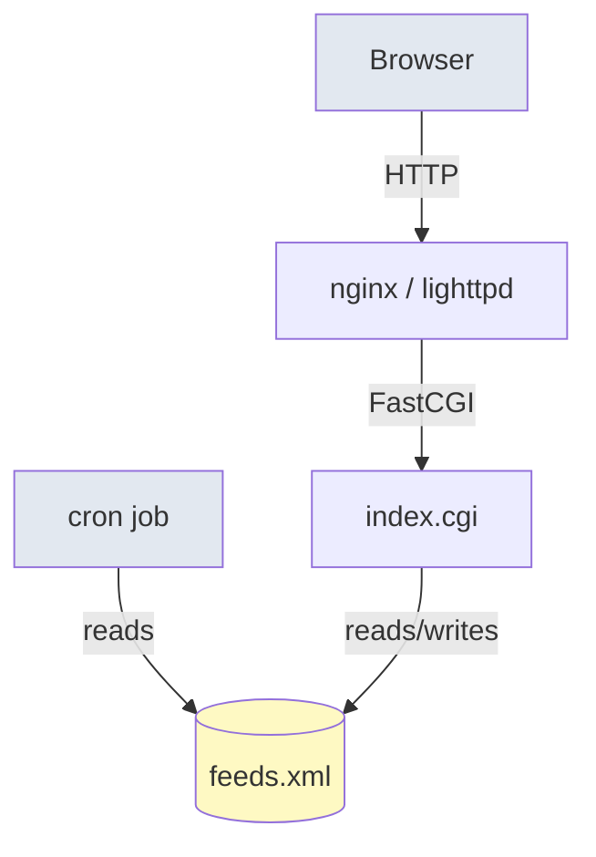
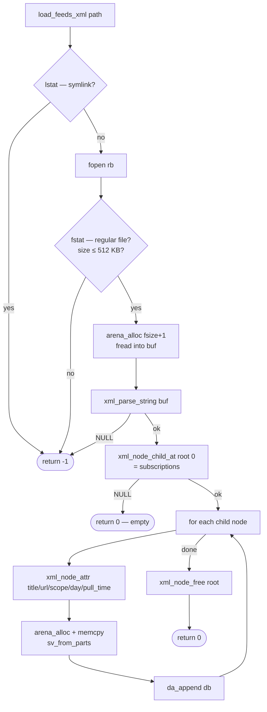
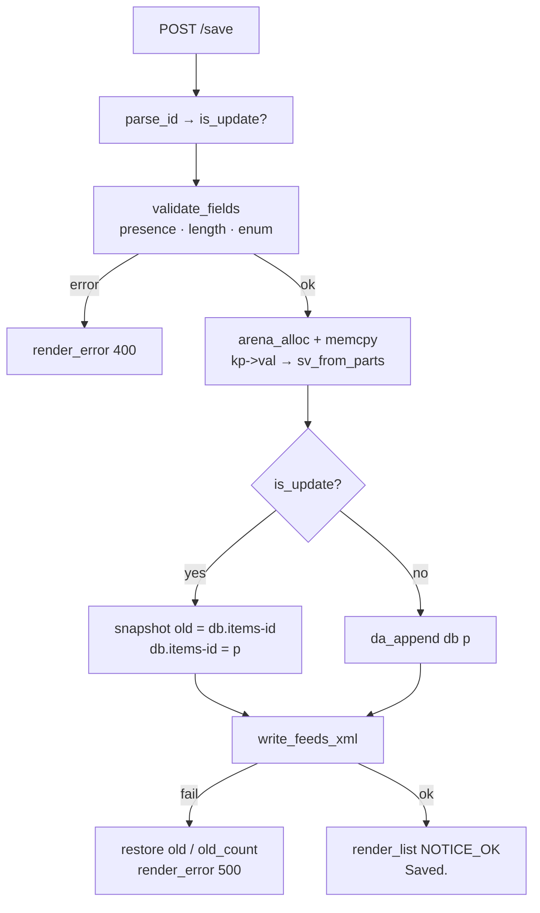
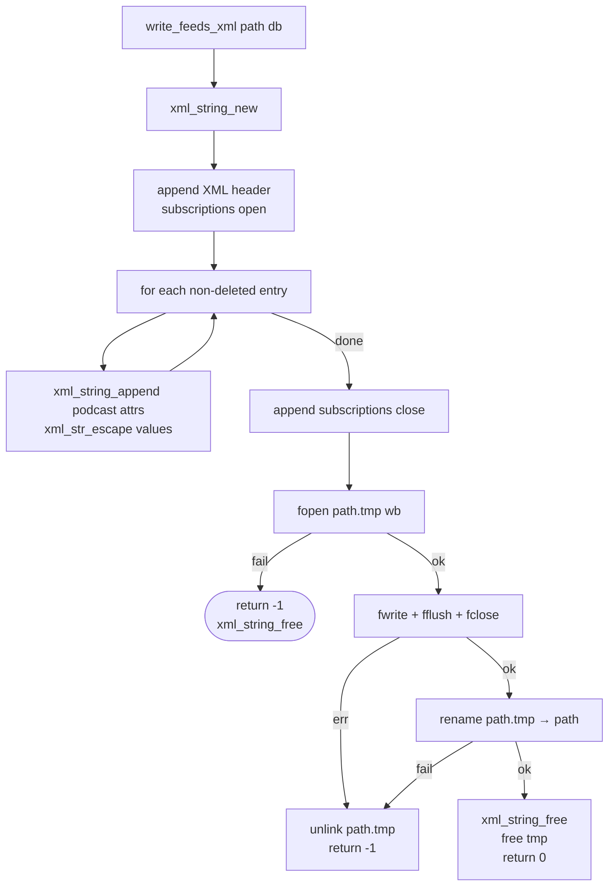
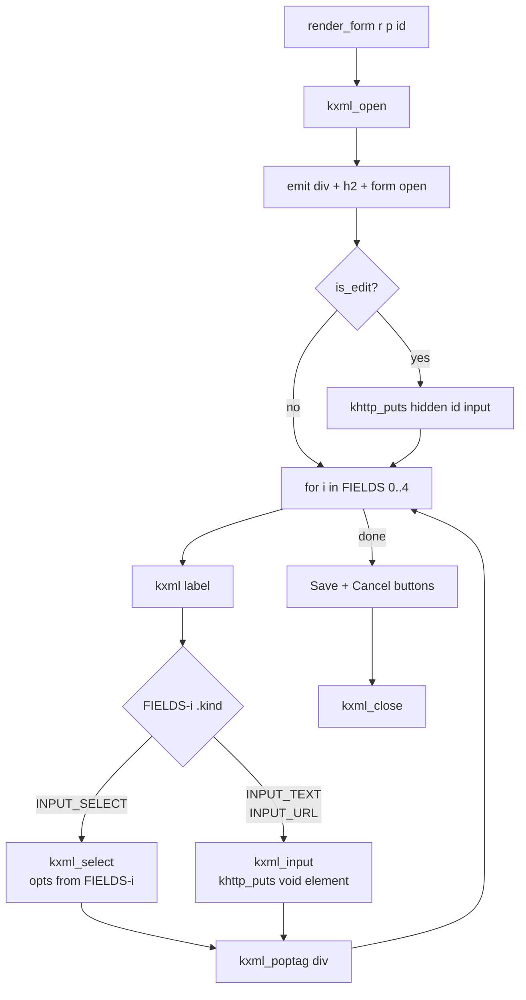
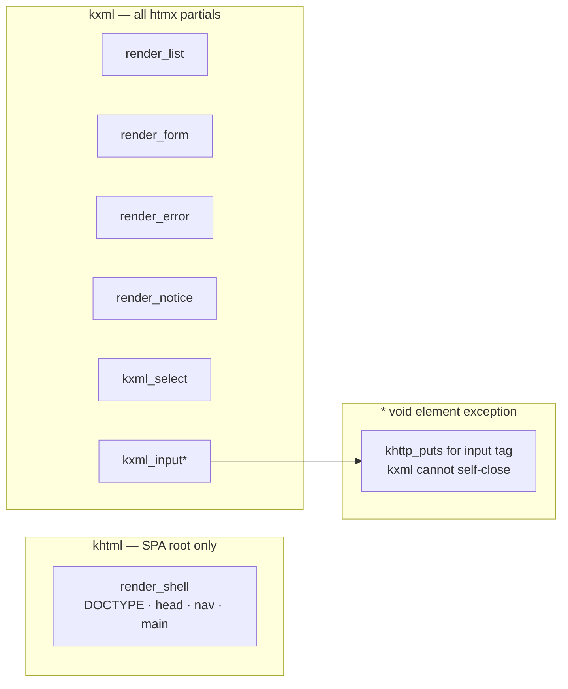

# podcast-mgr — Code Flow Diagram

Generated from `cflow` static call graph analysis of `main.c`.

## System Architecture



## Worker Lifecycle

```mermaid
flowchart TD
    START([process start]) --> INIT[arena_init\n4 MB root arena]
    INIT --> PAGES[build pages[] from\nROUTES table]
    PAGES --> FCGI[khttp_fcgi_init\nregister keys + routes]
    FCGI --> PATH[resolve_config_path\nXDG_CONFIG_HOME / HOME]
    PATH --> LOAD[load_feeds_xml]
    LOAD --> SANDBOX[sandbox_lockdown_rw\nseccomp / Capsicum / pledge]
    SANDBOX --> LOOP{khttp_fcgi_parse\naccept loop}

    LOOP -->|KCGI_OK| METHOD{method matches\nROUTES table?}
    METHOD -->|no| ERR_405[render_error\nMethod not allowed]
    METHOD -->|yes| DISPATCH{r.page}

    DISPATCH --> IDX[PAGE_INDEX\nrender_shell khtml]
    DISPATCH --> LIST[PAGE_LIST\nrender_list kxml]
    DISPATCH --> ADD[PAGE_ADD\nrender_form kxml]
    DISPATCH --> EDIT[PAGE_EDIT\nparse_id → render_form]
    DISPATCH --> SAVE[PAGE_SAVE\nvalidate → upsert → write]
    DISPATCH --> DEL[PAGE_DELETE\nsoft-delete → write]

    IDX --> FREE[khttp_free]
    LIST --> FREE
    ADD --> FREE
    EDIT --> FREE
    SAVE --> FREE
    DEL --> FREE
    ERR_405 --> FREE
    FREE --> LOOP

    LOOP -->|done| CLEANUP[khttp_fcgi_free\narena_destroy]
    CLEANUP --> EXIT([exit 0])

    LOAD -->|fail| FATAL([exit 1])
    PATH -->|fail| FATAL
    FCGI -->|fail| FATAL
    SANDBOX -->|fail| FATAL
```

## load_feeds_xml



## PAGE_SAVE — upsert flow



## write_feeds_xml — atomic write



## render_form — data-driven field loop



## Renderer split: khtml vs kxml


